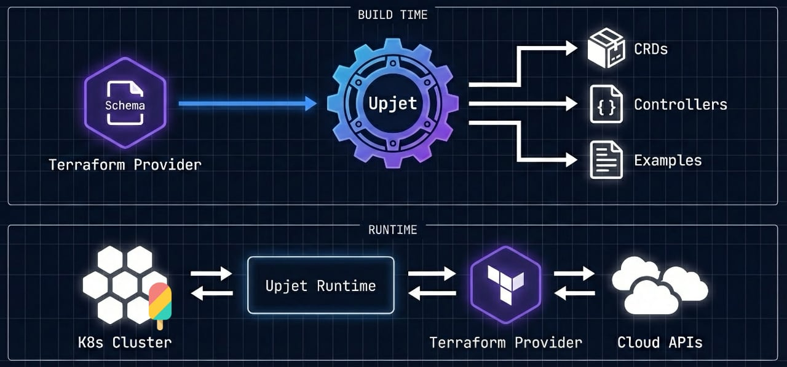
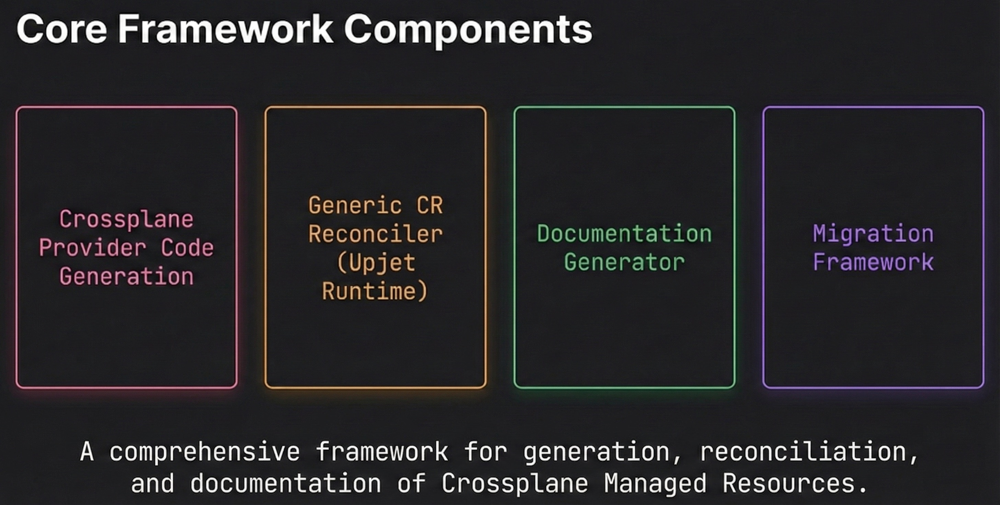

<!--
SPDX-FileCopyrightText: 2026 The Crossplane Authors <https://crossplane.io>

SPDX-License-Identifier: CC-BY-4.0
-->

# Upjet - Generate Crossplane Providers from any Terraform Provider

Upjet is a code generation framework and Kubernetes controller runtime that
transforms Terraform providers into Crossplane providers. It generates Kubernetes
CRDs, reconciliation controllers, and example manifests while providing runtime
libraries for API conversions, Terraform state management, and resource lifecycle
operations. It powers the official AWS, Azure, and GCP providers along with 50+
community providers.

## Table of Contents

- [Key Features](#key-features)
- [When to Use Upjet](#when-to-use-upjet)
- [Architecture](#architecture)
- [Providers Built with Upjet](#providers-built-with-upjet)
- [Documentation](#documentation)
- [Contributing](#contributing)
- [Community](#community)
- [Prior Art](#prior-art)
- [License](#license)

## Key Features

- **Multiple Terraform Execution Modes**
  - *Terraform CLI*: Traditional fork-based Terraform CLI and Terraform provider
    process spawning
  - *Terraform Plugin SDK v2*: Direct Go library integration (no-CLI invocation)
  - *Terraform Plugin Framework*: Protocol-based communication via protov6 (no-CLI invocation)

- **Automatic Resource Generation**
  - Kubernetes CRDs highly conformant to the Crossplane Resource Model
    ([XRM](https://docs.crossplane.io/latest/managed-resources/managed-resources/))
    from Terraform schemas
  - Reconciliation controllers with full CRUD lifecycle
  - Example manifests, API documentation, (partial) API validation rules, etc.

- **Cross-Resource References**
  - Kubernetes-native reference resolution between resources
  - Automatic selector generation for resource lookups

- **Management Policies** (Crossplane v1.11+)
  - Fine-grained control over resource lifecycle operations
  - Observe-only mode for importing existing infrastructure

- **Advanced Capabilities**
  - External name mapping for resource identification
  - Late initialization from provider responses
  - Sync & async operations for long-running resources
  - Sensitive field handling with connection secrets

## When to Use Upjet

**Upjet is ideal when:**

- A Terraform provider already exists for your target platform
- You want to leverage Terraform's battle-tested resource logic
- You need broad coverage of infrastructure resources quickly
- Your team is familiar with Terraform provider semantics

**Consider a native Crossplane provider when:**

- No Terraform provider exists for your platform
- You need deeply customized reconciliation logic
- You require precise control over the Kubernetes API surface
- Performance requirements exceed what Terraform execution allows

## Architecture

Upjet bridges the gap between Terraform's vast provider ecosystem and
Kubernetes-native infrastructure management. At build time, Upjet reads a
Terraform provider's schema and generates everything needed for a Crossplane
provider: Go types, Custom Resource Definitions, and reconciliation controllers.
At runtime, these controllers use Terraform's resource logic to manage
infrastructure, while exposing a pure Kubernetes API to users.

1. **Code Generation Pipeline** - Transforms Terraform schemas into Go types,
   CRDs, and controllers
2. **Generic CR Reconcilers** - Runtimes that handle reconciliation for all
   generated resources
3. **Documentation Scraper** - Extracts and generates API documentation, example
   manifests (used for e2e testing and documentation), cross-resource references,
   etc. from Terraform docs
4. **Migration Framework** - Supports migrating resources between different
   providers of the same external API, like migrating from the community AWS
   provider (crossplane-contrib/provider-aws) to the official provider
   (upbound/provider-aws)
5. **API Conversion Framework** - Handles lifecycle management and breaking
   changes between API versions of the same CRD
6. **Resource Configuration Framework** - Implements various configuration
   aspects (external name, sync/async behavior, API naming, API versions,
   cross-resource references, etc.) for Upjet resources

## Providers Built with Upjet

### Major Cloud Providers

- [Amazon Web Services](https://github.com/crossplane-contrib/provider-upjet-aws)
- [Microsoft Azure](https://github.com/crossplane-contrib/provider-upjet-azure)
- [Google Cloud Platform](https://github.com/crossplane-contrib/provider-upjet-gcp)

### Additional Providers

- [Grafana](https://github.com/grafana/crossplane-provider-grafana)
- [GitHub](https://github.com/crossplane-contrib/provider-upjet-github)

Browse the [Upbound Marketplace](https://marketplace.upbound.io/providers) for a full list of available providers.

## Documentation

| Guide | Description |
|-------|-------------|
| [Generating a Provider](docs/generating-a-provider.md) | Create a new Crossplane provider from scratch |
| [Configuring a Resource](docs/configuring-a-resource.md) | External names, references, and resource customization |
| [Adding New Resources](docs/adding-new-resource.md) | Add resources to an existing provider |
| [Testing with Uptest](docs/testing-with-uptest.md) | End-to-end testing framework |
| [Monitoring](docs/monitoring.md) | Prometheus metrics for the Upjet runtime |
| [Upgrading to v2](docs/upjet-v2-upgrade.md) | Migration guide from Upjet v1 to v2 |
| [Managing CRD Versions](docs/managing-crd-versions.md) | Handle Terraform schema changes across versions |

## Contributing

We welcome contributions! Please see our [Contributing Guide](CONTRIBUTING.md) for details.

## Community

- **Slack:** [#upjet](https://crossplane.slack.com/archives/C05T19TB729) on
  [Crossplane Slack](https://slack.crossplane.io)
- **Twitter:** [@crossplane_io](https://twitter.com/crossplane_io)
- **Issues:** [GitHub Issues](https://github.com/crossplane/upjet/issues)

## Prior Art

Upjet originates from the [Terrajet][terrajet] project. See the original
[design document][terrajet-design-doc].

## License

Upjet is under [the Apache 2.0 license](LICENSE) with [notice](NOTICE).

[terrajet-design-doc]: https://github.com/crossplane/crossplane/blob/main/design/design-doc-terrajet.md
[terrajet]: https://github.com/crossplane/terrajet
