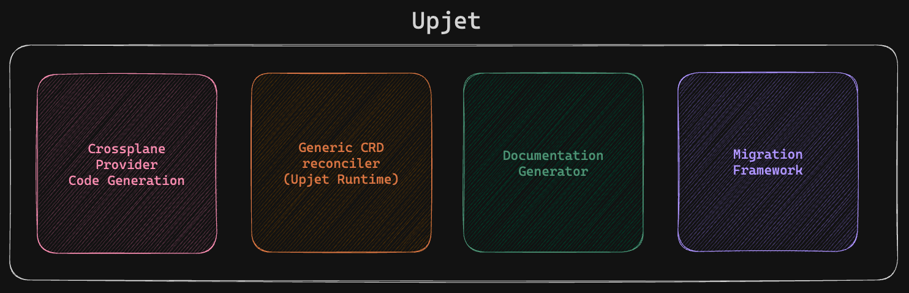

<!--
SPDX-FileCopyrightText: 2023 The Crossplane Authors <https://crossplane.io>

SPDX-License-Identifier: CC-BY-4.0
-->

# What is Upjet?

Upjet consists of four main components:

1. Framework to build a code generator pipeline for Crossplane providers.
1. Generic reconciler implementation (also known as the Upjet runtime) used by
   all generated `CustomResourceDefinitions`.
1. A scraper to extract documentation for all generated
   `CustomResourceDefinitions`.
1. Migration framework to support migrating from community providers to Official
   Providers.

## Generating a Crossplane provider using Upjet

Follow the guide to start [generating a Crossplane
provider](generating-a-provider.md).

Further information on developing a provider:

- Guide for how to [configure a resource](configuring-a-resource.md) in your
provider.
- Guide on how to use Uptest to [test your resources](testing-with-uptest.md)
end to end.
- Guide on how to add support for
[management policies](adding-support-for-management-policies.md) to an existing
provider.
- Guide on how to [add a new resource](adding-new-resource.md) to an existing provider.

## Additional documentation

- [Provider identity based authentication](design-doc-provider-identity-based-auth.md)
- [Monitoring](monitoring.md) the Upjet runtime using Prometheus.

Feel free to ask your questions by opening an issue or starting a discussion in
the [#upjet](https://crossplane.slack.com/archives/C05T19TB729) channel in
[Crossplane Slack](https://slack.crossplane.io).
