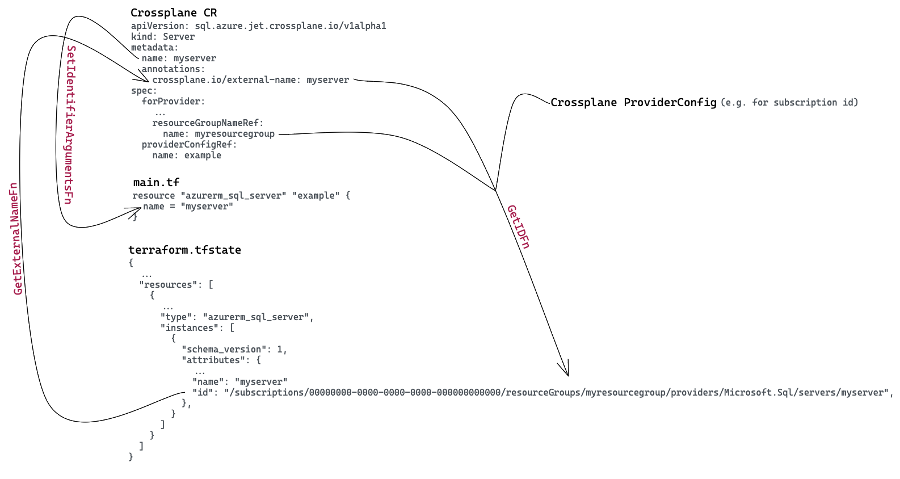

<!--
SPDX-FileCopyrightText: 2023 The Crossplane Authors <https://crossplane.io>

SPDX-License-Identifier: CC-BY-4.0
-->
# Configuring a resource

[Upjet] generates as much as it could using the available information in the
Terraform resource schema. This includes an XRM-conformant schema of the
resource, controller logic, late initialization, sensitive data handling, etc.
However, there are still information that requires some input configuration
which can be found by checking the Terraform documentation of the resource:

- [External name]
- [Cross Resource Referencing]
- [Additional Sensitive Fields and Custom Connection Details]
- [Late Initialization Behavior]
- [Overriding Terraform Resource Schema]
- [Initializers]

## External Name

Crossplane uses `crossplane.io/external-name` annotation in managed resource CR
to identify the external resource which is managed by Crossplane and always
shows the final value of the external resource name.

See [the external name documentation]
and [Naming Conventions - One Pager Managed Resource API Design] for more
details

The format and source of the external name depends on the cloud provider;
sometimes it could simply be the name of resource (e.g. S3 Bucket), and
sometimes it is an auto-generated id by cloud API (e.g. VPC id ). That is
something specific to resource, and we need some input configuration for `upjet`
to appropriately generate a resource.

Since Terraform already needs [a similar identifier] to import a resource, most
helpful part of resource documentation is the [import section].

Upjet performs some back and forth conversions between Crossplane resource model
and Terraform configuration. We need a custom, per resource configuration to
adapt Crossplane `external name` from Terraform `id`.

Here are [the types for the External Name configuration]:

```go
// SetIdentifierArgumentsFn sets the name of the resource in Terraform attributes map,
// i.e. Main HCL file.
type SetIdentifierArgumentsFn func(base map[string]any, externalName string)
// GetExternalNameFn returns the external name extracted from the TF State.
type GetExternalNameFn func(tfstate map[string]any) (string, error)
// GetIDFn returns the ID to be used in TF State file, i.e. "id" field in
// terraform.tfstate.
type GetIDFn func(ctx context.Context, externalName string, parameters map[string]any, providerConfig map[string]any) (string, error)

// ExternalName contains all information that is necessary for naming operations,
// such as removal of those fields from spec schema and calling Configure function
// to fill attributes with information given in external name.
type ExternalName struct {
  // SetIdentifierArgumentFn sets the name of the resource in Terraform argument
  // map. In many cases, there is a field called "name" in the HCL schema, however,
  // there are cases like RDS DB Cluster where the name field in HCL is called
  // "cluster_identifier". This function is the place that you can take external
  // name and assign it to that specific key for that resource type.
  SetIdentifierArgumentFn SetIdentifierArgumentsFn

  // GetExternalNameFn returns the external name extracted from TF State. In most cases,
  // "id" field contains all the information you need. You'll need to extract
  // the format that is decided for external name annotation to use.
  // For example the following is an Azure resource ID:
  // /subscriptions/00000000-0000-0000-0000-000000000000/resourceGroups/mygroup1
  // The function should return "mygroup1" so that it can be used to set external
  // name if it was not set already.
  GetExternalNameFn GetExternalNameFn

  // GetIDFn returns the string that will be used as "id" key in TF state. In
  // many cases, external name format is the same as "id" but when it is not
  // we may need information from other places to construct it. For example,
  // the following is an Azure resource ID:
  // /subscriptions/00000000-0000-0000-0000-000000000000/resourceGroups/mygroup1
  // The function here should use information from supplied arguments to
  // construct this ID, i.e. "mygroup1" from external name, subscription ID
  // from providerConfig, and others from parameters map if needed.
  GetIDFn GetIDFn

  // OmittedFields are the ones you'd like to be removed from the schema since
  // they are specified via external name. For example, if you set
  // "cluster_identifier" in SetIdentifierArgumentFn, then you need to omit
  // that field.
  // You can omit only the top level fields.
  // No field is omitted by default.
  OmittedFields []string

  // DisableNameInitializer allows you to specify whether the name initializer
  // that sets external name to metadata.name if none specified should be disabled.
  // It needs to be disabled for resources whose external identifier is randomly
  // assigned by the provider, like AWS VPC where it gets vpc-21kn123 identifier
  // and not let you name it.
  DisableNameInitializer bool
}
```

Comments explain the purpose of each field but let's clarify further with some
example cases.

### Case 1: Name as External Name and Terraform ID

This is the simplest and most straightforward case with the following
conditions:

- Terraform resource uses the `name` argument to identify the resources
- Terraform resource can be imported with `name`, i.e. `id`=`name`

[aws_iam_user] is a good example here. In this case, we can just use the
[NameAsIdentifier] config of Upjet as follows:

```go
import (
 "github.com/crossplane/upjet/v2/pkg/config"
 ...
)

...
    p.AddResourceConfigurator("aws_iam_user", func(r *config.Resource) {
        r.ExternalName = config.NameAsIdentifier
  ...
    }
```

There are some resources which fits into this case with an exception by
expecting an argument other than `name` to name/identify a resource, for
example, [bucket] for [aws_s3_bucket] and [cluster_identifier] for
[aws_rds_cluster].

Let's check [aws_s3_bucket] further. Reading the [import section of s3 bucket]
we see that bucket is imported with its **name**, however, checking _arguments_
section we see that this name is provided with the [bucket] argument. We also
notice, there is also another argument as `bucket_prefix` which conflicts with
`bucket` argument. We can just use the [NameAsIdentifier] config, however, we
also need to configure the `bucket` argument with `SetIdentifierArgumentFn` and
also omit `bucket` and `bucket_prefix` arguments from the spec with
`OmittedFields`:

```go
import (
 "github.com/crossplane/upjet/v2/pkg/config"
 ...
)

...
    p.AddResourceConfigurator("aws_s3_bucket", func(r *config.Resource) {
        r.ExternalName = config.NameAsIdentifier
        r.ExternalName.SetIdentifierArgumentFn = func(base map[string]any, externalName string) {
            base["bucket"] = externalName
        }
        r.ExternalName.OmittedFields = []string{
            "bucket",
            "bucket_prefix",
        }
  ...
    }
```

### Case 2: Identifier from Provider

In this case, the (cloud) provider generates an identifier for the resource
independent of what we provided as arguments.

Checking the [import section of aws_vpc], we see that this resource is being
imported with `vpc id`. When we check the [arguments list] and provided [example
usages], it is clear that this **id** is **not** something that user provides,
rather generated by AWS API.

Here, we can just use [IdentifierFromProvider] configuration:

```go
import (
 "github.com/crossplane/upjet/v2/pkg/config"
 ...
)

...
    p.AddResourceConfigurator("aws_vpc", func(r *config.Resource) {
        r.ExternalName = config.IdentifierFromProvider
  ...
    }
```

### Case 3: Terraform ID as a Formatted String

For some resources, Terraform uses a formatted string as `id` which include
resource identifier that Crossplane uses as external name but may also contain
some other parameters.

Most `azurerm` resources fall into this category. Checking the [import section
of azurerm_sql_server], we see that can be imported with an `id` in the
following format:

```text
/subscriptions/00000000-0000-0000-0000-000000000000/resourceGroups/myresourcegroup/providers/Microsoft.Sql/servers/myserver
```

To properly set external name for such a resource, we need to configure how to
extract external name from this string (`GetExternalNameFn`) and how to build
this id back (`GetIDFn`).

```go
import (
 "github.com/crossplane/upjet/v2/pkg/config"
 ...
)

func getNameFromFullyQualifiedID(tfstate map[string]any) (string, error) {
 id, ok := tfstate["id"]
 if !ok {
  return "", errors.Errorf(ErrFmtNoAttribute, "id")
 }
 idStr, ok := id.(string)
 if !ok {
  return "", errors.Errorf(ErrFmtUnexpectedType, "id")
 }
 words := strings.Split(idStr, "/")
 return words[len(words)-1], nil
}

func getFullyQualifiedIDfunc(ctx context.Context, externalName string, parameters map[string]any, providerConfig map[string]any) (string, error) {
 subID, ok := providerConfig["subscription_id"]
    if !ok {
        return "", errors.Errorf(ErrFmtNoAttribute, "subscription_id")
    }
    subIDStr, ok := subID.(string)
    if !ok {
        return "", errors.Errorf(ErrFmtUnexpectedType, "subscription_id")
    }
    rg, ok := parameters["resource_group_name"]
    if !ok {
        return "", errors.Errorf(ErrFmtNoAttribute, "resource_group_name")
    }
    rgStr, ok := rg.(string)
    if !ok {
        return "", errors.Errorf(ErrFmtUnexpectedType, "resource_group_name")
    }

 name, ok := parameters["name"]
    if !ok {
        return "", errors.Errorf(ErrFmtNoAttribute, "name")
    }
    nameStr, ok := rg.(string)
    if !ok {
        return "", errors.Errorf(ErrFmtUnexpectedType, "name")
    }

    return fmt.Sprintf("/subscriptions/%s/resourceGroups/%s/providers/Microsoft.Sql/servers/%s", subIDStr, rgStr, nameStr), nil
}

...
    p.AddResourceConfigurator("azurerm_sql_server", func(r *config.Resource) {
        r.ExternalName = config.NameAsIdentifier
        r.ExternalName.GetExternalNameFn = getNameFromFullyQualifiedID
        r.ExternalName.GetIDFn = getFullyQualifiedIDfunc
  ...
    }
```

With this, we have covered most common scenarios for configuring external name.
You can always check resource configurations of existing jet Providers as
further examples under `config/<group>/config.go` in their repositories.

_Please see [this figure] to understand why we really need 3 different functions
to configure external names and, it visualizes which is used how:_
 _Note that, initially, GetIDFn
will use the external-name annotation to set the terraform.tfstate id and, after
that, it uses the terraform.tfstate id to update the external-name annotation.
For cases where both values are different, both GetIDFn and GetExternalNameFn
must be set in order to have the correct configuration._

### Cross Resource Referencing

Crossplane uses cross resource referencing to [handle dependencies] between
managed resources. For example, if you have an IAM User defined as a Crossplane
managed resource, and you want to create an Access Key for that user, you would
need to refer to the User CR from the Access Key resource. This is handled by
cross resource referencing.

See how the [user] referenced at `forProvider.userRef.name` field of the Access
Key in the following example:

```yaml
apiVersion: iam.aws.tf.crossplane.io/v1alpha1
kind: User
metadata:
  name: sample-user
spec:
  forProvider: {}
---
apiVersion: iam.aws.tf.crossplane.io/v1alpha1
kind: AccessKey
metadata:
  name: sample-access-key
spec:
  forProvider:
    userRef:
      name: sample-user
  writeConnectionSecretToRef:
    name: sample-access-key-secret
    namespace: crossplane-system
```

Historically, reference resolution method were written by hand which requires
some effort, however, with the latest Crossplane code generation tooling, it is
now possible to [generate reference resolution methods] by just adding some
marker on the fields. Now, the only manual step for generating cross resource
references is to provide which field of a resource depends on which information
(e.g. `id`, `name`, `arn` etc.) from the other.

In Upjet, we have a [configuration] to provide this information for a field:

```go
// Reference represents the Crossplane options used to generate
// reference resolvers for fields
type Reference struct {
    // Type is the Go type name of the CRD if it is in the same package or
    // <package-path>.<type-name> if it is in a different package.
    Type string
    // TerraformName is the name of the Terraform resource
    // which will be referenced. The supplied resource name is
    // converted to a type name of the corresponding CRD using
    // the configured TerraformTypeMapper.
    TerraformName string
    // Extractor is the function to be used to extract value from the
    // referenced type. Defaults to getting external name.
    // Optional
    Extractor string
    // RefFieldName is the field name for the Reference field. Defaults to
    // <field-name>Ref or <field-name>Refs.
    // Optional
    RefFieldName string
    // SelectorFieldName is the Go field name for the Selector field. Defaults to
    // <field-name>Selector.
    // Optional
    SelectorFieldName string
}
```

> [!Warning]
> Please note the `Reference.Type` field has been deprecated, use
`Reference.TerraformName` instead. `TerraformName` is a more stable and
less error prone API compared to `Type` because it automatically accounts
for the configuration changes affecting the cross-resource reference target's
kind name, group or version.

For a resource that we want to generate, we need to check its argument list in
Terraform documentation and figure out which field needs reference to which
resource.

Let's check [iam_access_key] as an example. In the argument list, we see the
[user] field which requires a reference to a IAM user. So, we need to the
following referencing configuration:

```go
func Configure(p *config.Provider) {
    p.AddResourceConfigurator("aws_iam_access_key", func (r *config.Resource) {
        r.References["user"] = config.Reference{
            TerraformName: "aws_iam_user",
        }
    })
}
```

`TerraformName` is the name of the Terraform resource, such as
`aws_iam_user`. Because `TerraformName` uniquely identifies a
Terraform resource, it remains the same when the referenced and
referencing resources are in different groups. A good example is
referencing a [kms key] from `aws_ebs_volume` resource:

```go
func Configure(p *config.Provider) {
    p.AddResourceConfigurator("aws_ebs_volume", func(r *config.Resource) {
        r.References["kms_key_id"] = config.Reference{
           TerraformName: "aws_kms_key",
        }
    })
}
```

### Auto Cross Resource Reference Generation

Cross Resource Referencing is one of the key concepts of the resource
configuration. As a very common case, cloud services depend on other cloud
services. For example, AWS Subnet resource needs an AWS VPC for creation. So,
for creating a Subnet successfully, before you have to create a VPC resource.
Please see the [Managed Resources] documentation for more details.

These documentations focus on the general concepts and manual configurations
of Cross Resource References. However, the main topic of this documentation is
automatic example&reference generation.

Upjet has a scraper tool for scraping provider metadata from the Terraform
Registry. The scraped metadata are:

- Resource Descriptions
- Examples of Resources (in HCL format)
- Field Documentations
- Import Statements

These are very critical information for our automation processes. We use this
scraped metadata in many contexts. For example, field documentation of
resources and descriptions are used as Golang comments for schema fields and
CRDs.

Another important scraped information is examples of resources. As a part
of testing efforts, finding the correct combination of field values is not easy
for every scenario. So, having a working example (combination) is very important
for easy testing.

At this point, this example that is in HCL format is converted to a Managed
Resource manifest, and we can use this manifest in our test efforts.

This is an example from Terraform Registry AWS Ebs Volume resource:

```hcl
resource "aws_ebs_volume" "example" {
  availability_zone = "us-west-2a"
  size              = 40

  tags = {
    Name = "HelloWorld"
  }
}

resource "aws_ebs_snapshot" "example_snapshot" {
  volume_id = aws_ebs_volume.example.id

  tags = {
    Name = "HelloWorld_snap"
  }
}
```

The generated example:

```yaml
apiVersion: ec2.aws.upbound.io/v1beta1
kind: EBSSnapshot
metadata:
  annotations:
    meta.upbound.io/example-id: ec2/v1beta1/ebssnapshot
  labels:
    testing.upbound.io/example-name: example_snapshot
  name: example-snapshot
spec:
  forProvider:
    region: us-west-1
    tags:
      Name: HelloWorld_snap
    volumeIdSelector:
      matchLabels:
        testing.upbound.io/example-name: example

---

apiVersion: ec2.aws.upbound.io/v1beta1
kind: EBSVolume
metadata:
  annotations:
    meta.upbound.io/example-id: ec2/v1beta1/ebssnapshot
  labels:
    testing.upbound.io/example-name: example
  name: example
spec:
  forProvider:
    availabilityZone: us-west-2a
    region: us-west-1
    size: 40
    tags:
      Name: HelloWorld
```

Here, there are three very important points that scraper makes easy our life:

- We do not have to find the correct value combinations for fields. So, we can
  easily use the generated example manifest in our tests.
- The HCL example was scraped from registry documentation of the
  `aws_ebs_snapshot` resource. In the example, you also see the `aws_ebs_volume`
  resource manifest because, for the creation of an EBS Snapshot, you need an
  EBS Volume resource. Thanks to the source Registry, (in many cases, there are
  the dependent resources of target resources) we can also scrape the
  dependencies of target resources.
- The last item is actually what is intended to be explained in this document.
  For using the Cross Resource References, as I mentioned above, you need to add
  some references to the resource configuration. But, in many cases, if in the
  scraped example, the mentioned dependencies are already described you do not
  have to write explicit references to resource configuration. The Cross
  Resource Reference generator generates the mentioned references.

### Validating the Cross Resource References

As I mentioned, many references are generated from scraped metadata by an auto
reference generator. However, there are two cases where we miss generating the
references.

The first one is related to some bugs or improvement points in the generator.
This means that the generator can handle many references in the scraped examples
and correctly generate them. But we cannot say that the ratio is 100%. For some
cases, the generator cannot generate references, even though they are in the
scraped example manifests.

The second one is related to the scraped example itself. As I mentioned above,
the source of the generator is the scraped example manifest. So, it checks the
manifest and tries to generate the found cross-resource references. In some
cases, although there are other reference fields, these do not exist in the
example manifest. They can only be mentioned in schema/field documentation.

For these types of situations, you must configure cross-resource references
explicitly.

### Removing Auto-Generated Cross Resource References In Some Corner Cases

In some cases, the generated references can narrow the reference pool covered by
the field. For example, X resource has an A field and Y and Z resources can be
referenced via this field. However, since the reference to Y is mentioned in the
example manifest, this reference field will only be defined over Y. In this
case, since the reference pool of the relevant field will be narrowed, it would
be more appropriate to delete this reference. For example,

```hcl
resource "aws_route53_record" "www" {
  zone_id = aws_route53_zone.primary.zone_id
  name    = "example.com"
  type    = "A"

  alias {
    name                   = aws_elb.main.dns_name
    zone_id                = aws_elb.main.zone_id
    evaluate_target_health = true
  }
}
```

Route53 Record resource’s alias.name field has a reference. In the example, this
reference is shown by using the `aws_elb` resource. However, when we check the
field documentation, we see that this field can also be referenced by other
resources:

```text
Alias
Alias records support the following:

name - (Required) DNS domain name for a CloudFront distribution, S3 bucket, ELB,
or another resource record set in this hosted zone.
```

### Conclusion

As a result, mentioned scraper and example&reference generators are very useful
for making easy the test efforts. But using these functionalities, we must be
careful to avoid undesired states.

[Managed Resources]: https://docs.crossplane.io/latest/concepts/managed-resources/#referencing-other-resources

## Additional Sensitive Fields and Custom Connection Details

Crossplane stores sensitive information of a managed resource in a Kubernetes
secret, together with some additional fields that would help consumption of the
resource, a.k.a. [connection details].

In Upjet, we already handle sensitive fields that are marked as sensitive in
Terraform schema and no further action required for them. Upjet will properly
hide these fields from CRD spec and status by converting to a secret reference
or storing in connection details secret respectively. However, we still have
some custom configuration API that would allow including additional fields into
connection details secret no matter they are sensitive or not.

As an example, let's use `aws_iam_access_key`. Currently, Upjet stores all
sensitive fields in Terraform schema as prefixed with `attribute.`, so without
any `AdditionalConnectionDetailsFn`, connection resource will have
`attribute.id` and `attribute.secret` corresponding to [id] and [secret] fields
respectively. To see them with more common keys, i.e. `aws_access_key_id` and
`aws_secret_access_key`, we would need to make the following configuration:

```go
func Configure(p *config.Provider) {
 p.AddResourceConfigurator("aws_iam_access_key", func(r *config.Resource) {
  r.Sensitive.AdditionalConnectionDetailsFn = func(attr map[string]any) (map[string][]byte, error) {
   conn := map[string][]byte{}
   if a, ok := attr["id"].(string); ok {
    conn["aws_access_key_id"] = []byte(a)
   }
   if a, ok := attr["secret"].(string); ok {
    conn["aws_secret_access_key"] = []byte(a)
   }
   return conn, nil
  }
 })
}
```

This will produce a connection details secret as follows:

```yaml
apiVersion: v1
data:
  attribute.id: QUtJQVk0QUZUVFNFNDI2TlhKS0I=
  attribute.secret: ABCxyzRedacted==
  attribute.ses_smtp_password_v4: QQ00REDACTED==
  aws_access_key_id: QUtJQVk0QUZUVFNFNDI2TlhKS0I=
  aws_secret_access_key: ABCxyzRedacted==
kind: Secret
```

### Late Initialization Configuration

Late initialization configuration is only required if there are conflicting
arguments in terraform resource configuration. Unfortunately, there is _no easy
way_ to figure that out without testing the resource, _so feel free to skip this
configuration_ at the first place and revisit _only if_ you have errors like
below while testing the resource.

```text
observe failed: cannot run refresh: refresh failed: Invalid combination of arguments:
  "address_prefix": only one of `address_prefix,address_prefixes` can be specified, but `address_prefix,address_prefixes` were specified.: File name: main.tf.json
```

If you would like to have the late-initialization library _not_ to process the
[`address_prefix`] parameter field, then the following configuration where we
specify the parameter field path is sufficient:

```go
func Configure(p *config.Provider) {
 p.AddResourceConfigurator("azurerm_subnet", func(r *config.Resource) {
  r.LateInitializer = config.LateInitializer{
   IgnoredFields: []string{"address_prefix"},
  }
 })
}
```

_Please note that, there could be errors looking slightly different from above,
so please consider configuring late initialization behaviour whenever you got
some unexpected error starting with `observe failed:`, once you are sure that
you provided all necessary parameters to your resource._

### Further details on Late Initialization

Upjet runtime automatically performs late-initialization during an
[`external.Observe`] call with means of runtime reflection. State of the world
observed by Terraform CLI is used to initialize any `nil`-valued pointer
parameters in the managed resource's `spec`. In most of the cases no custom
configuration should be necessary for late-initialization to work. However,
there are certain cases where you will want/need to customize
late-initialization behaviour. Thus, Upjet provides an extensible
[late-initialization customization API] that controls late-initialization
behaviour.

The associated resource struct is defined
[here](https://github.com/crossplane/upjet/blob/c9e21387298d8ed59fcd71c7f753ec401a3383a5/pkg/config/resource.go#L91)
as follows:

```go
// LateInitializer represents configurations that control
// late-initialization behaviour
type LateInitializer struct {
    // IgnoredFields are the canonical field names to be skipped during
    // late-initialization
    IgnoredFields []string
}
```

Currently, it only involves a configuration option to specify certain `spec`
parameters to be ignored during late-initialization. Each element of the
`LateInitializer.IgnoredFields` slice represents the canonical path relative to
the parameters struct for the managed resource's `Spec` using `Go` type names as
path elements. As an example, with the following type definitions:

```go
type Subnet struct {
    metav1.TypeMeta   `json:",inline"`
    metav1.ObjectMeta `json:"metadata,omitempty"`
    Spec              SubnetSpec   `json:"spec"`
    Status            SubnetStatus `json:"status,omitempty"`
}

type SubnetSpec struct {
    ForProvider     SubnetParameters `json:"forProvider"`
    ...
}

type DelegationParameters struct {
    // +kubebuilder:validation:Required
    Name *string `json:"name" tf:"name,omitempty"`
    ...
}

type SubnetParameters struct {
    // +kubebuilder:validation:Optional
    AddressPrefix *string `json:"addressPrefix,omitempty" tf:"address_prefix,omitempty"`
    // +kubebuilder:validation:Optional
    Delegation []DelegationParameters `json:"delegation,omitempty" tf:"delegation,omitempty"`
    ...
}
```

In most cases, custom late-initialization configuration will not be necessary.
However, after generating a new managed resource and observing its behaviour (at
runtime), it may turn out that late-initialization behaviour needs
customization. For certain resources like the `provider-tf-azure`'s
`PostgresqlServer` resource, we have observed that Terraform state contains
values for mutually exclusive parameters, e.g., for `PostgresqlServer`, both
`StorageMb` and `StorageProfile[].StorageMb` get late-initialized. Upon next
reconciliation, we generate values for both parameters in the Terraform
configuration, and although they happen to have the same value, Terraform
configuration validation requires them to be mutually exclusive. Currently, we
observe this behaviour at runtime, and upon observing that the resource cannot
transition to the `Ready` state and acquires the Terraform validation error
message in its `status.conditions`, we do the `LateInitializer.IgnoreFields`
custom configuration detailed above to skip one of the mutually exclusive fields
during late-initialization.

## Overriding Terraform Resource Schema

Upjet generates Crossplane resource schemas (CR spec/status) using the
[Terraform schema of the resource]. As of today, Upjet leverages the following
attributes in the schema:

- [Type] and [Elem] to identify the type of the field.
- [Sensitive] to see if we need to keep it in a Secret instead of CR.
- [Description] to add as a description to the field in CRD.
- [Optional] and [Computed] to identify whether the fields go under spec or
  status:
  - Not Optional & Not Computed => Spec (required)
  - Optional & Not Computed => Spec (optional)
  - Optional & Computed => Spec (optional, to be late-initialized)
  - Not Optional & Computed => Status

Usually, we don't need to make any modifications in the resource schema and
resource schema just works as is. However, there could be some rare edge cases
like:

- Field contains sensitive information but not marked as `Sensitive` or vice
  versa.
- An attribute does not make sense to have in CRD schema, like [tags_all for
  provider-upjet-aws resources].
- Moving parameters from Terraform provider config to resources schema to fit
  Crossplane model, e.g. [AWS region] parameter is part of provider config in
  Terraform but Crossplane expects it in CR spec.

Schema of a resource could be overridden as follows:

```go
p.AddResourceConfigurator("aws_autoscaling_group", func(r *config.Resource) {
    // Managed by Attachment resource.
    if s, ok := r.TerraformResource.Schema["load_balancers"]; ok {
        s.Optional = false
        s.Computed = true
    }
    if s, ok := r.TerraformResource.Schema["target_group_arns"]; ok {
        s.Optional = false
        s.Computed = true
    }
})
```

## Initializers

Initializers involve the operations that run before beginning of reconciliation.
This configuration option will provide that setting initializers for per
resource.

Many resources in aws have `tags` field in their schema. Also, in Crossplane
there is a [tagging convention]. To implement the tagging convention for jet-aws
provider, this initializer configuration support was provided.

There is a common struct (`Tagger`) in upjet to use the tagging convention:

```go
// Tagger implements the Initialize function to set external tags
type Tagger struct {
 kube      client.Client
 fieldName string
}

// NewTagger returns a Tagger object.
func NewTagger(kube client.Client, fieldName string) *Tagger {
 return &Tagger{kube: kube, fieldName: fieldName}
}

// Initialize is a custom initializer for setting external tags
func (t *Tagger) Initialize(ctx context.Context, mg xpresource.Managed) error {
 paved, err := fieldpath.PaveObject(mg)
 if err != nil {
  return err
 }
 pavedByte, err := setExternalTagsWithPaved(xpresource.GetExternalTags(mg), paved, t.fieldName)
 if err != nil {
  return err
 }
 if err := json.Unmarshal(pavedByte, mg); err != nil {
  return err
 }
 if err := t.kube.Update(ctx, mg); err != nil {
  return err
 }
 return nil
}
```

As seen above, the `Tagger` struct accepts a `fieldName`. This `fieldName`
specifies which value of field to set in the resource's spec. You can use the
common `Initializer` by specifying the field name that points to the external
tags in the configured resource.

There is also a default initializer for tagging convention, `TagInitializer`. It
sets the value of `fieldName` to `tags` as default:

```go
// TagInitializer returns a tagger to use default tag initializer.
var TagInitializer NewInitializerFn = func(client client.Client) managed.Initializer {
 return NewTagger(client, "tags")
}
```

In jet-aws provider, as a default process, if a resource has `tags` field in its
schema, then the default initializer (`TagInitializer`) is added to Initializer
list of resource:

```go
// AddExternalTagsField adds ExternalTagsFieldName configuration for resources that have tags field.
func AddExternalTagsField() tjconfig.ResourceOption {
 return func(r *tjconfig.Resource) {
  if s, ok := r.TerraformResource.Schema["tags"]; ok && s.Type == schema.TypeMap {
   r.InitializerFns = append(r.InitializerFns, tjconfig.TagInitializer)
  }
 }
}
```

However, if the field name that used for the external label is different from
the `tags`, the `NewTagger` function can be called and the specific `fieldName`
can be passed to this:

```go
r.InitializerFns = append(r.InitializerFns, func(client client.Client) managed.Initializer {
 return tjconfig.NewTagger(client, "example_tags_name")
})
```

If the above tagging convention logic does not work for you, and you want to use
this configuration option for a reason other than tagging convention (for
another custom initializer operation), you need to write your own struct in
provider and have this struct implement the `Initializer` function with a custom
logic.

This configuration option is set by using the [InitializerFns] field that is a
list of [NewInitializerFn]:

```go
// NewInitializerFn returns the Initializer with a client.
type NewInitializerFn func(client client.Client) managed.Initializer
```

Initializer is an interface in [crossplane-runtime]:

```go
type Initializer interface {
 Initialize(ctx context.Context, mg resource.Managed) error
}
```

So, an interface must be passed to the related configuration field for adding
initializers for a resource.

[Upjet]: https://github.com/crossplane/upjet
[External name]: #external-name
[Cross Resource Referencing]: #cross-resource-referencing
[Additional Sensitive Fields and Custom Connection Details]: #additional-sensitive-fields-and-custom-connection-details
[Late Initialization Behavior]: #late-initialization-configuration
[Overriding Terraform Resource Schema]: #overriding-terraform-resource-schema
[the external name documentation]: https://docs.crossplane.io/master/concepts/managed-resources/#naming-external-resources
[import section]: https://registry.terraform.io/providers/hashicorp/aws/latest/docs/resources/iam_access_key#import
[the types for the External Name configuration]: https://github.com/crossplane/upjet/blob/main/pkg/config/resource.go#L68
[aws_iam_user]: https://registry.terraform.io/providers/hashicorp/aws/latest/docs/resources/iam_user
[NameAsIdentifier]: https://github.com/crossplane/upjet/blob/main/pkg/config/externalname.go#L28
[aws_s3_bucket]: https://registry.terraform.io/providers/hashicorp/aws/latest/docs/resources/s3_bucket
[import section of s3 bucket]: https://registry.terraform.io/providers/hashicorp/aws/latest/docs/resources/s3_bucket#import
[bucket]: https://registry.terraform.io/providers/hashicorp/aws/latest/docs/resources/s3_bucket#bucket
[cluster_identifier]: https://registry.terraform.io/providers/hashicorp/aws/latest/docs/resources/rds_cluster#cluster_identifier
[aws_rds_cluster]: https://registry.terraform.io/providers/hashicorp/aws/latest/docs/resources/rds_cluster
[import section of aws_vpc]: https://registry.terraform.io/providers/hashicorp/aws/latest/docs/resources/vpc#import
[arguments list]: https://registry.terraform.io/providers/hashicorp/aws/latest/docs/resources/vpc#argument-reference
[example usages]: https://registry.terraform.io/providers/hashicorp/aws/latest/docs/resources/vpc#example-usage
[IdentifierFromProvider]: https://github.com/crossplane/upjet/blob/main/pkg/config/externalname.go#L42
[a similar identifier]: https://www.terraform.io/docs/glossary#id
[import section of azurerm_sql_server]: https://registry.terraform.io/providers/hashicorp/azurerm/latest/docs/resources/sql_server#import
[handle dependencies]: https://docs.crossplane.io/master/concepts/managed-resources/#referencing-other-resources
[user]: https://registry.terraform.io/providers/hashicorp/aws/latest/docs/resources/iam_access_key#user
[generate reference resolution methods]: https://github.com/crossplane/crossplane-tools/pull/35
[configuration]: https://github.com/crossplane/upjet/blob/942508c5370a697b1cb81d074933ba75d8f1fb4f/pkg/config/resource.go#L172
[iam_access_key]: https://registry.terraform.io/providers/hashicorp/aws/latest/docs/resources/iam_access_key#argument-reference
[kms key]: https://registry.terraform.io/providers/hashicorp/aws/latest/docs/resources/ebs_volume#kms_key_id
[connection details]: https://docs.crossplane.io/master/concepts/managed-resources/#writeconnectionsecrettoref
[id]: https://registry.terraform.io/providers/hashicorp/aws/latest/docs/resources/iam_access_key#id
[secret]: https://registry.terraform.io/providers/hashicorp/aws/latest/docs/resources/iam_access_key#secret
[`external.Observe`]: https://github.com/crossplane/upjet/blob/main/pkg/controller/external.go#L175
[late-initialization customization API]: https://github.com/crossplane/upjet/blob/main/pkg/resource/lateinit.go#L45
[`address_prefix`]: https://registry.terraform.io/providers/hashicorp/azurerm/latest/docs/resources/subnet#address_prefix
[Terraform schema of the resource]: https://github.com/hashicorp/terraform-plugin-sdk/blob/e3325b095ef501cf551f7935254ce942c44c1af0/helper/schema/schema.go#L34
[Type]: https://github.com/hashicorp/terraform-plugin-sdk/blob/e3325b095ef501cf551f7935254ce942c44c1af0/helper/schema/schema.go#L52
[Elem]: https://github.com/hashicorp/terraform-plugin-sdk/blob/e3325b095ef501cf551f7935254ce942c44c1af0/helper/schema/schema.go#L151
[Sensitive]: https://github.com/hashicorp/terraform-plugin-sdk/blob/e3325b095ef501cf551f7935254ce942c44c1af0/helper/schema/schema.go#L244
[Description]: https://github.com/hashicorp/terraform-plugin-sdk/blob/e3325b095ef501cf551f7935254ce942c44c1af0/helper/schema/schema.go#L120
[Optional]: https://github.com/hashicorp/terraform-plugin-sdk/blob/e3325b095ef501cf551f7935254ce942c44c1af0/helper/schema/schema.go#L80
[Computed]: https://github.com/hashicorp/terraform-plugin-sdk/blob/e3325b095ef501cf551f7935254ce942c44c1af0/helper/schema/schema.go#L139
[tags_all for provider-upjet-aws resources]: https://github.com/crossplane-contrib/provider-upjet-aws/blob/199dbf93b8c67632db50b4f9c0adbd79021146a3/config/overrides.go#L72
[AWS region]: https://github.com/crossplane-contrib/provider-upjet-aws/blob/199dbf93b8c67632db50b4f9c0adbd79021146a3/config/overrides.go#L42
[this figure]: ../docs/images/upjet-externalname.png
[Initializers]: #initializers
[InitializerFns]: https://github.com/crossplane/upjet/blob/92d1af84d24241bef08e6b4a2cfe1ab66a93308a/pkg/config/resource.go#L427
[NewInitializerFn]: https://github.com/crossplane/upjet/blob/92d1af84d24241bef08e6b4a2cfe1ab66a93308a/pkg/config/resource.go#L265
[crossplane-runtime]: https://github.com/crossplane/crossplane-runtime/blob/428b7c3903756bb0dcf5330f40298e1fa0c34301/pkg/reconciler/managed/reconciler.go#L138
[tagging convention]: https://github.com/crossplane/crossplane/blob/60c7df9/design/one-pager-managed-resource-api-design.md#external-resource-labeling
[Naming Conventions - One Pager Managed Resource API Design]: https://github.com/crossplane/crossplane/blob/main/design/one-pager-managed-resource-api-design.md#naming-conventions
