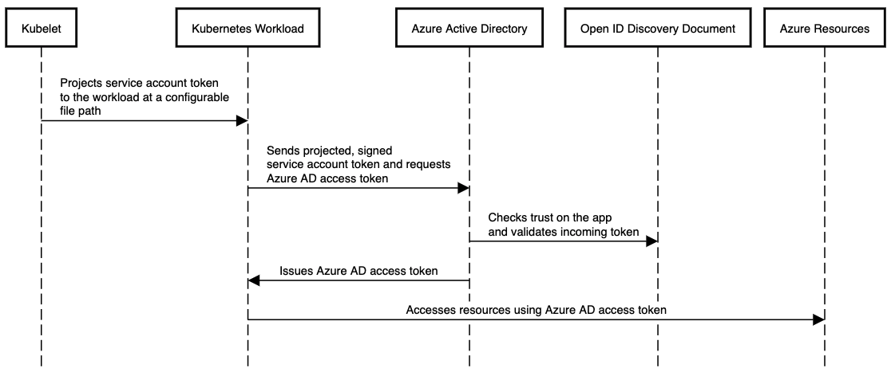

# Identity Based Authentication for Crossplane Providers

* Owner: Alper Rifat Uluçınar (@ulucinar)
* Reviewers: Crossplane Maintainers
* Status: Draft

## Background
Crossplane providers need to authenticate themselves to their respective Cloud
providers. This establishes an identity for the Crossplane provider that's later
used by the Cloud provider to authorize the requests made by the Crossplane
provider and for various other purposes such as audit logging, etc. Each
Crossplane provider supports a subset of the underlying Cloud provider's
authentication mechanisms and this subset is currently implemented in-tree,
i.e., in the Crossplane provider's repo, there exists a CRD that's
conventionally named as `ProviderConfig` and each managed resource of the
provider has a [v1.Reference](https://docs.crossplane.io/v1.12/concepts/managed-resources/#providerconfigref) to a `ProviderConfig` CR. This
`ProviderConfig` holds the authentication configuration (chosen authentication method,
any required credentials for that method, etc.) together with any other provider
specific configuration. Different authentication methods and/or different sets
of credentials can be configured using separate cluster-scoped `ProviderConfig`
CRs and by having different managed resources refer to these `ProviderConfig`
instances. 

The Crossplane provider establishes an identity for the requests it will issue
to the Cloud provider in the [managed.ExternalConnecter](https://pkg.go.dev/github.com/crossplane/crossplane-runtime@v0.19.2/pkg/reconciler/managed#ExternalConnecter)'s `Connect`
implementation. This involves calling the associated authentication functions from
the Cloud SDK libraries (such as the [AWS SDK for Go][aws-sdk] or the [Azure
SDK for Go][azure-sdk]) with the supplied configuration and credentials from the
referenced `ProviderConfig` instance.

Managed resources and `ProviderConfig`s are cluster-scoped, i.e., they do not exist within a
Kubernetes namespace but rather exist at the global (cluster) scope. This does
not fit well into a namespace-based multi-tenancy model, where each tenant is
confined to its own namespace. The cluster scope is shared between all
namespaces. In the namespace-based multi-tenancy model, the common approach is
to have Role-Based Access Control ([RBAC]) rules that disallow a tenant from
accessing API resources that do not reside in its namespace. Another dimension
to consider here is that all namespaced tenants are serviced by a shared
Crossplane provider deployment typically running in the `crossplane-system`
namespace. This shared provider instance (or more precisely, the [Kubernetes
ServiceAccount][k8s-sa] that the provider's pod uses) is allowed, via RBAC, to `get` the (cluster-scoped)
`ProviderConfig` resources. If tenant `subjects` (groups, users,
ServiceAccounts) are allowed to directly `create` managed resources, then we cannot
constrain them from referring to any `ProviderConfig` (thus to any Cloud
provider credential set) in the cluster solely using RBAC. This is because:
1. RBAC rules allow designated verbs (`get`, `list`, `create`, `update`, etc.)
   on the specified API resources for the specified subjects. If a subject,
   e.g., a `ServiceAccount`, is allowed to `create` a managed resource, RBAC
   alone cannot be used to constrain the set of `ProviderConfig`s that can be
   referenced by the `create`d managed resource.
1. The tenant subject itself does not directly access the `ProviderConfig` and in turn
   the Cloud provider credential set referred by the `ProviderConfig`. It's the
   Crossplane provider's `ServiceAccount` that accesses these resources, and as
   mentioned above, this ServiceAccount currently serves all tenants. This
   implies that we cannot isolate Cloud provider credentials among namespaced
   tenants by only using RBAC rules if we allow tenant subjects to have `edit`
   access (`create`, `update`, `patch`) to managed resources. Although it's
   possible to prevent them from reading Cloud provider credentials of other
   tenants in the cluster via RBAC rules, it's not possible to prevent them from
   _using_ those credentials solely with RBAC.

As discussed in detail in the [Crossplane Multi-tenancy Guide](https://docs.crossplane.io/knowledge-base/guides/multi-tenant/),
Crossplane is opinionated about the different personas in an organization adopting
Crossplane. We make a distinction between the _infrastructure operators_ (or
_platform builders_) who are expected to manage cluster-scoped resources (like
`ProviderConfig`s, XRDs and `Composition`s) and _application operators_, who are
expected to consume the infrastructure for their applications. And tenant
subjects are classified as _application operators_, i.e., it's the
infrastructure operator's responsibility to manage the infrastructure _across_
the tenants via cluster-scoped Crossplane resources, and it's possible and
desirable from an isolation perspective to disallow application operators, who
are tenant subjects, to directly access these shared cluster-scoped resources.
This distinction is currently possible with Crossplane because: 
1. Crossplane `Claim` types are defined via cluster-scoped XRDs by
   infrastructure operators and _namespaced_ `Claim` instances are used by the
   tenant subjects. This allows infrastructure operators to define RBAC rules
   that allow tenant subjects to only access resources in their respective
   namespaces, e.g., `Claim`s.
1. However, [1] is not sufficient on itself, as the scheme is still prone to
   privilege escalation attacks if the API exposed by the XR is not well designed. The
   (shared) provider `ServiceAccount` has access to all Cloud provider
   credentials in the cluster and if the exposed XR API allows a `Claim` to
   reference cross-tenant `ProviderConfig`s, then a misbehaving tenant subject
   can `create` a `Claim` which references some other tenant's credential set.
   Thus in our multi-tenancy [guide](https://docs.crossplane.io/knowledge-base/guides/multi-tenant/), we propose a security scheme where:
    1. The infrastructure operator follows a specific naming convention for the
       `ProviderConfig`s she provisions: The `ProviderConfig`s for different
       tenants are named after those tenants' namespaces. 
    2. The infrastructure operator carefully designs `Composition`s that patch
       `spec.providerConfigRef` of composed resources using the `Claim`'s
       namespace. 
    3. Tenant subjects are **not** allowed to provision managed resources directly (and also
       XRDs or `Composition`s) but only `Claim`s in their namespaces. And any
       `Composition` they can select with their `Claim`s will compose resources
       that refer to a `ProviderConfig` provisioned for their tenant (the
       `ProviderConfig` with the same name as the tenant's namespace). 
    4. We also suggest that the naming conventions imposed by this scheme on
       `ProviderConfig`s can be relaxed to some degree by using `Composition`'s
       [patching capabilities](https://docs.crossplane.io/v1.12/concepts/composition/#compositions). For instance, a string
       [transform][patch-transform] of type `Format` can be used to combine the
       `Claim`'s namespace with an XR field's value to allow multiple
       `ProviderConfig`s per tenant and to allow selection of the
       `ProviderConfig` with the `Claim`. 

As explained above, RBAC rules can only impose restrictions on the actions
(`get`, `update`, etc.) performed on the API resource endpoints but they cannot
impose constraints on the API resources themselves (objects) available at these
endpoints. Thus, we also discuss using one of the available policy engines that
can run integrated with the Kubernetes API server to further impose restrictions
on the resources. For example, the following [kyverno] [policy][kyverno-policy]
prevents a tenant subject (`tenant1/user1`) from specifying in `Claim`s any
`ProviderConfig` names without the prefix `tenant1` (_please do not use this
example policy in production environments as it has a security vulnerability as
we will discuss shortly_):

```yaml
# XRD
apiVersion: apiextensions.crossplane.io/v1
kind: CompositeResourceDefinition
metadata:
  name: compositeresourcegroups.example.org
spec:
  group: example.org
  names:
    kind: CompositeResourceGroup
    plural: compositeresourcegroups
  claimNames:
    kind: ClaimResourceGroup
    plural: claimresourcegroups
  versions:
  - name: v1alpha1
    served: true
    referenceable: true
    schema:
      openAPIV3Schema:
        type: object
        properties:
          spec:
            type: object
            properties:
              name:
                type: string
              providerConfigName:
                type: string
            required:
              - name

---

# kyverno ClusterPolicy
apiVersion: kyverno.io/v1
kind: ClusterPolicy
metadata:
  name: tenant1
spec:
  validationFailureAction: enforce
  background: false
  rules:
  - name: check-for-providerconfig-ref
    match:
      any:
      - resources:
          kinds:
            # G/V/K for the Claim type
          - example.org/v1alpha1/ClaimResourceGroup
        subjects:
        - kind: User
          name: tenant1/user1
    validate:
      message: "Only ProviderConfig names that have the prefix tenant1 are allowed for users under tenant1"
      pattern:
        spec:
          providerConfigName: tenant1*

---

# related patch in a Composition
...
      patches:
         - fromFieldPath: spec.providerConfigName
           toFieldPath: spec.providerConfigRef.name
```


### Limitations of Naming Convention-based or Admission Controller-based Approaches
The naming convention-based or admission controller-based approaches described
above are not straightforward to configure, especially if you also consider that
in addition to the RBAC configurations needed to isolate the tenants
(restricting access to the cluster-wide resources), resource quotas and network
policies are also needed to properly isolate and fairly distribute the worker
node resources and the network resources, respectively. Also due to the
associated complexity, it's easy to misconfigure the cluster and difficult to
verify a given security configuration guarantees proper isolation between
the tenants. 

As an example, consider the Kyverno `ClusterPolicy` given above:
While the intent is to restrict the users under `tenant1` to using only the
`ProviderConfig`s installed for them (e.g., those with names `tenant1*`), the
scheme is broken if there exists a tenant in the system with `tenant1` as a
prefix to its name, such as `tenant10`. 

Organizations, especially with hard multi-tenancy requirements (i.e., with
tenants assumed to be untrustworthy or actively malicious), may not prefer or
strictly forbid such approaches. The architectural problem here, from a security
perspective, is that the Crossplane provider (and also the core Crossplane
components) is a shared resource itself and it requires cross-tenant privileges
such as accessing cluster-wide resources and accessing each tenant's namespaced
resources (especially tenant Cloud credentials). This increases the attack
surface in the dimensions of:
- Logical vulnerabilities (see the above example for a misconfiguration)
- Isolation vulnerabilities: For instance, controller *workqueue*s become shared
  resources between the tenants. How can we ensure, for instance, that the workqueue capacity
  is fairly shared between the tenants?
- Code vulnerabilities: As an example, consider a hypothetical Crossplane
  provider bug in which the provider fetches another `ProviderConfig` than the
  one declared in the managed resource, or other credentials than the ones
  declared in the referred `ProviderConfig`. Although the logical barriers
  enforced by the `Composition`s or the admission controllers as descibed above
  are not broken, the too privileged provider itself breaks the cross-tenant
  barrier.

In the current Crossplane provider deployment model, when a Crossplane provider
package is installed, there can be a single *active* `ProviderRevision`
associated with it, which owns (via an owner reference) the Kubernetes
deployment for running the provider. This single deployment, in turn, specifies
a single Kubernetes service account under which the provider runs.

Apart from a vulnerability perspective, there are also some other limitations to
this architecture, which are related to identity-based authentication.

**Note**: The [multi-tenancy guide](https://docs.crossplane.io/knowledge-base/guides/multi-tenant/) also mentions multi-cluster
multi-tenancy, where tenants are run on their respective Kubernetes clusters.
This form of multi-tenancy is out of scope in this document. 
 
### Identity-based Authentication Schemes
Various Cloud providers, such as AWS, Azure and GCP, have some means of
identity-based authentication. With identity-based authentication an entity,
such as a Cloud service (a database server, a Kubernetes cluster, etc.) or a
workload (an executable running in a VM, a pod running in a Kubernetes cluster)
is assigned a Cloud identity and further authorization checks are performed
against this identity. The advantage with identity-based authentication is that
no manually provisioned credentials are required. 

The traditional way for authenticating a Crossplane provider to the Cloud
provider is to first provision a Cloud identity such as an AWS IAM user or a GCP
service account or an Azure AD service principal and a set of credentials
associated with that identity (such as an AWS access key or a GCP service
account key or Azure client ID & secret) and then to provision a Kubernetes
secret containing these credentials. Then a `ProviderConfig` refers to this
Kubernetes secret. There are some undesirable consequences of this flow:
- The associated Cloud credentials are generally long-term credentials and
  require manual rotation.
- For fine-grained access control, you need multiple identities with such
  credentials to be manually managed & rotated. 
- These generally result in reusing such credentials, which in turn prevents
  fine-grained access control and promotes aggregation of privileges. 

Different Cloud providers have different identity-based authentication
implementations: 

**AWS**: [EKS node IAM roles][aws-eks-node-iam], or IAM roles for service
accounts ([IRSA]) both allow for identity-based authentication. IRSA has
eliminated the need for some third-party solutions such as [kiam] or [kube2iam]
and associates an IAM role with a Kubernetes service account. Using IRSA for
authenticating `provider-aws` is [possible][provider-aws-irsa]. IRSA leverages
the [service account token volume projection][k8s-sa-projection] support
introduced with Kubernetes 1.12. When enabled, `kubelet`
[projects][k8s-volume-projection] a signed OIDC JWT for a pod's service account
at the requested volume mount path in a container and periodically rotates the
token. An AWS client can then exchange this token (issued by the API server)
with *temporary* credentials for an IAM role via the AWS Security Token Service
([STS]) [AssumeRoleWithWebIdentity] API operation. The IAM role to be associated
with the Kubernetes service account can be specified via an annotation on the
service account (`eks.amazonaws.com/role-arn`). As we will discuss later, this
can also be used in conjunction with IAM role chaining to implement fine-grained
access control. 

As of this writing, `provider-aws` [supports][provider-aws-auth] `IRSA`, role
chaining (via the [STS] [AssumeRole] API operation), and the [STS
AssumeRoleWithWebIdentity][AssumeRoleWithWebIdentity] API operation. This allows
us to authenticate `provider-aws` using the projected service account token by
exhanging it with a set of temporary credentials associated with an IAM role.
This set of temporary credentials consists of an access key ID, a secret access
key and a security token. Also the target IAM role ARN (Amazon Resource Name) is
configurable via the `provider-aws`'s `ProviderConfig` API. This allows
Crossplane users to implement a fine-grained access policy for different
tenants possibly using different AWS accounts:
- The initial IAM role, which is the target IAM role for the `IRSA`
  authentication (via the `AssumeRoleWithWebIdentity` STS API
  operation) does not need privileges on the managed external resources when
  role chaining is used.
- `provider-aws` then assumes another IAM role by exchanging the initial set of
  temporary credentials via STS role chaining. However, currently the
  `ProviderConfig` API does not allow chains of length greater than one, i.e.,
  `provider-aws` can only call the STS `AssumeRole` API once in a given chain.
  This is currently an artificial limitation in `provider-aws` imposed by the
  `ProviderConfig` API. 
- The target role ARN for the initial IRSA `AssumeRoleWithWebIdentity` operation
  is configurable via the `ProviderConfig` API. Thus, if a proper cross-AWS
  account trust policy exists between the EKS cluster's OIDC provider and a
  target IAM role in a different account (than the account owning the EKS
  cluster and the OIDC provider), then it's possible to switch to an IAM role in
  that target AWS account.
- Privileges on the managed external resources need to be defined on the target
  IAM roles of the STS `Assume*` operations. And as mentioned, fine-grained
  access policies can be defined on these target roles which are configurable
  with the `ProviderConfig` API.
- When combined with the already available single-cluster multi-tenancy
  techniques discussed above, this allows `provider-aws` users to isolate their
  tenant identities and the privileges required for those identities.

From the relevant discussions on `provider-aws` surveyed for this writing, this
level of tenant isolation has mostly been sufficient for `provider-aws` users.
But as discussed above, a deeper isolation is still possible. Especially in the
currently feasible `provider-aws` authentication scheme, the initial
`AssumeRoleWithWebIdentity` target IAM role is still shared by the tenants
although it does not require privileges on the managed external resources. But
due to vulnerabilities discussed in the [Limitations of Naming Convention-based
or Admission Controller-based Approaches] section above, it could still be
possible for a tenant to assume an IAM role with more privileges than it needs,
starting with the shared `AssumeRoleWithWebIdentity` target IAM role. A deeper
isolation between tenants would be possible if it were possible to have a
Kubernetes service account and an associated (initial) non-shared IAM role
assigned to each tenant.

As of this writing, `provider-jet-aws` supports IRSA authentication with support
for role chaining via the STS `AssumeRole` API operation. Similar to
`provider-aws`, only chains of length `1` are allowed. Also, `provider-jet-aws`
does not currently support specifying the target `AssumeRoleWithWebIdentity` IAM
role via the `ProviderConfig` API. And unlike `provider-aws`, `provider-jet-aws`
does not support specifying external IDs, session tags or transitive tag keys
for the `AssumeRole` operation, or specifying session names for the
`AssumeRoleWithWebIdentity` operation.

**Azure**: Azure has the notion of system-assigned or user-assigned [managed
identities][azure-msi], which allow authentication to any resource that supports
Azure AD authentication. Some Azure services, such as EKS, allow a managed
identity to be enabled directly on a service's instance (system-assigned). Or a
user-assigned managed identity can be provisioned and assigned to the service
instance. Similar to AWS IRSA, Azure has also introduced [Azure AD workload
identities][azure-wi], which work in a similar way to IRSA:

|     |
| :-: |
|  |
| Azure AD Workload Identities (reproduced from [[1]]) |

In Azure AD workload identities, similar to IRSA, a Kubernetes service account
is associated with an Azure AD application client ID via the
`azure.workload.identity/client-id` annotation on the service account object. 

As of this writing, none of `provider-azure` or `provider-jet-azure` supports
Azure workload identities. Terraform native `azurerm` provider itself currently
does *not* support workload identities, thus there are technical challenges if
we would like to introduce support for workload identities in
`provider-jet-azure`. However, using lower level APIs (then the [Azure Identity
SDK for Go][azidentity]), it should be possible to [implement][azure-329]
workload identities for `provider-azure`. 

Both `provider-azure` and `provider-jet-azure` support system-assigned and
user-assigned managed identitites as an alternate form of identity-based
authentication (with `provider-azure` support being introduced by this
[PR][azure-330]).

Using system-assigned managed identities, it's *not* possible to implement an
isolation between tenants (see the discussion above for `provider-aws`) by using
separate Azure AD (AAD) applications (service principals) for them, because the
system-assigned managed identity is shared between those tenants and currently
it's not possible to switch identities within the Crossplane Azure providers*.
However, using user-assigned managed identities and per-tenant `ProviderConfig`s
as discussed above in the context of single-cluster multi-tenancy, it's possible
to implement fine-grained access control for tenants again with the same
limitations mentioned there. 

*: Whether there exists an Azure service (similar to the [STS] of AWS) that allows
us to exchange credentials of an AAD application with (temporary) credentials of
another AAD application needs further investigation. 


**GCP**: GCP also [recommends][gcp-wi] workload identities for assigning
identities to workloads running in GKE clusters. With GKE workload identities, a
Kubernetes service account is associated with a GCP IAM service account. And
similar to AWS and Azure, GCP also uses an annotation
(`iam.gke.io/gcp-service-account`) on the Kubernetes service account object
which specifies the GCP service account to be impersonated.

As of this writing, both `provider-gcp` and `provider-jet-gcp` support workload
identities, which are based on Kubernetes service accounts similar to AWS IRSA
and Azure AD workload identities. Thus, current implementations share the same
limitations detailed in [Limitations of Naming Convention-based or Admission
Controller-based Approaches].

**Summary for the existing Crossplane AWS, Azure & GCP providers**:

In all the three Kubernetes workload identity schemes introduced above, a
Kubernetes service account is mapped to a Cloud provider identity (IAM
role/service account, AD application, etc.) And as explained in depth above, the
current Crossplane provider deployment model allows the provider to be run under
a single Kubernetes service account.

Users of `provider-aws` have so far combined [IRSA] with AWS STS role chaining
(`AssumeRoleWithWebIdentity` and `AssumeRole` STS API operations) to meet their
organizational requirements around least-privilege and fine-grained access
control, and they have isolated their tenants sharing the same Crossplane
control-plane using the single-cluster multi-tenancy techniques described above.
However, currently lacking similar semantics for "role chaining", to the best of
our knowledge, users of AKS and GKE workload identities cannot implement
similar fine-grained access control scenarios because the Crossplane provider is
running as a single Kubernetes deployment, which in turn is associated with a
single Kubernetes service account. And for `provider-aws` users who would like
to have more strict tenant isolation, we need more flexibility in the Crossplane
deployment model.

## Decoupling Crossplane Provider Deployment
Flexibility in Crossplane provider deployment has been discussed especially in
[[2]] and [[3]]. [[2]] proposes a provider partitioning scheme on
`ProviderConfig`s and [[3]] calls for a *Provider Runtime Interface* for
decoupling the runtime aspects of a provider (where & how a provider is deployed
& run) from the core Crossplane package manager. We can combine these two
approaches to have an extensible, flexible and future-proof deployment model for
Crossplane providers that would also better meet the requirements around tenant
isolation. Instead of partitioning based on `ProviderConfig`s, as an
alternative, we could have an explicit partitioning API based on provider
runtime configurations specified in `Provider.pkg`s:

```yaml
apiVersion: pkg.crossplane.io/v1
kind: Provider
metadata:
  name: crossplane-provider-azure
spec:
  package: crossplane/provider-azure:v0.19.0
  ...
  runtimeConfigs:
  - name: deploy-1
    runtime:    
      apiVersion: runtime.crossplane.io/v1alpha1
      kind: KubernetesDeployment
      spec:
        # ControllerConfig reference that defines the corresponding Kubernetes deployment
        controllerConfigRef:
          name: cc-1
  - name: deploy-2
    runtime:
      apiVersion: runtime.crossplane.io/v1alpha1
      kind: KubernetesDeployment
      spec:
        # ControllerConfig reference that defines the corresponding Kubernetes deployment
        controllerConfigRef:
          name: cc-2
  - name: container-1
    runtime:
      apiVersion: runtime.crossplane.io/v1alpha1
      kind: DockerContainer
      spec:
        # some Docker client options
        host: /var/run/docker.sock
        config: ...
        # some docker run options
        runOptions:
          user: ...
          network: ...
  - ...
```

In the proposed scheme, the `PackageRevision` controller would no longer
directly manage a Kubernetes deployment for the active revision. Instead it
would provision, for the active revision, a number of Kubernetes resources
corresponding to each runtime configuration specified in the `runtimeConfigs`
array. For the above example, the `PackageRevision` controller would provision
two `KubernetesDeployment` and one `DockerContainer` *runtime configuration*
resources for the active revision. An example `KubernetesDeployment` object
provisioned by the `PackageRevision` controller could look like the following:

```yaml
apiVersion: runtime.crossplane.io/v1alpha1
kind: KubernetesDeployment
metadata:
  name: deploy-1
  ownerReferences:
  - apiVersion: pkg.crossplane.io/v1
    controller: true
    kind: ProviderRevision
    name: crossplane-provider-azure-91818efefdbe
    uid: 3a58c719-019f-43eb-b338-d6116e299974
spec:
  crossplaneProvider: crossplane/provider-azure-controller:v0.19.0
  # ControllerConfig reference that defines the corresponding Kubernetes deployment
  controllerConfigRef:
    name: cc-1
```

As an alternative, in order to deprecate the `ControllerConfig` API, the
`KubernetesDeployment` could also be defined as follows:

```yaml
...
  runtimeConfigs:
  - name: deploy-1
    runtime:    
      apiVersion: runtime.crossplane.io/v1alpha1
      kind: KubernetesDeployment
      spec:
        template:
          # metadata that defines the corresponding Kubernetes deployment's metadata
          metadata:
            ...
          # spec that defines the corresponding Kubernetes deployment's spec
          spec:
            ...
```

This scheme makes the runtime implementation pluggable, i.e., in different
environments we can have different *provider runtime configuration* contollers
running (as Kubernetes controllers) with different capabilities. For instance,
the existing deployment implementation embedded into the `PackageRevision`
controller can still be shipped with the core Crossplane with a corresponding
runtime configuration object. But another runtime configuration controller,
which is also based on Kubernetes deployments, can implement advanced isolation
semantics.


[1]: https://azure.github.io/azure-workload-identity/docs/introduction.html
[2]: https://github.com/crossplane/crossplane/issues/2411
[3]: https://github.com/crossplane/crossplane/issues/2671


[v1.Reference]: TODO
[managed.ExternalConnecter]: TODO
[aws-sdk]: https://github.com/aws/aws-sdk-go-v2
[azure-sdk]: https://github.com/Azure/azure-sdk-for-go
[RBAC]: https://kubernetes.io/docs/reference/access-authn-authz/rbac/
[k8s-sa]:
    https://kubernetes.io/docs/tasks/configure-pod-container/configure-service-account/
[xp-mt]: https://docs.crossplane.io/knowledge-base/guides/multi-tenant/
[xp-2093]: https://github.com/crossplane/crossplane/pull/2093
[ref-compositions]: https://docs.crossplane.io/v1.12/concepts/composition/#compositions
[patch-transform]:
    https://github.com/crossplane/crossplane/blob/6c1b06507db47801c7a1c7d91704783e8d13856f/apis/apiextensions/v1/composition_transforms.go#L64
[kyverno]: https://kyverno.io/
[kyverno-policy]: https://kyverno.io/docs/kyverno-policies/
[aws-eks-node-iam]:
    https://docs.aws.amazon.com/eks/latest/userguide/create-node-role.html
[IRSA]:
    https://docs.aws.amazon.com/eks/latest/userguide/iam-roles-for-service-accounts.html
[kiam]: https://github.com/uswitch/kiam
[kube2iam]: https://github.com/jtblin/kube2iam
[provider-aws-auth]: https://github.com/crossplane/provider-aws/blob/36299026cd9435c260ad13b32223d2e5fef3c443/AUTHENTICATION.md
[provider-aws-irsa]:
    https://github.com/crossplane/provider-aws/blob/36299026cd9435c260ad13b32223d2e5fef3c443/AUTHENTICATION.md#using-iam-roles-for-serviceaccounts
[k8s-sa-projection]:
    https://kubernetes.io/docs/tasks/configure-pod-container/configure-service-account/#service-account-token-volume-projection
[azure-msi]:
    https://docs.microsoft.com/en-us/azure/active-directory/managed-identities-azure-resources/overview
[azure-wi]:
    https://azure.github.io/azure-workload-identity/docs/introduction.html
[k8s-volume-projection]:
    https://kubernetes.io/docs/concepts/storage/projected-volumes/
[STS]: https://docs.aws.amazon.com/STS/latest/APIReference/welcome.html
[AssumeRoleWithWebIdentity]:
    https://docs.aws.amazon.com/STS/latest/APIReference/API_AssumeRoleWithWebIdentity.html
[AssumeRole]:
    https://docs.aws.amazon.com/STS/latest/APIReference/API_AssumeRole.html
[gcp-wi]:
    https://cloud.google.com/kubernetes-engine/docs/concepts/workload-identity
[azidentity]: https://github.com/Azure/azure-sdk-for-go/tree/main/sdk/azidentity
[azure-329]: https://github.com/crossplane/provider-azure/issues/329
[azure-330]: https://github.com/crossplane/provider-azure/pull/330

[hnc]: https://github.com/kubernetes-sigs/hierarchical-namespaces