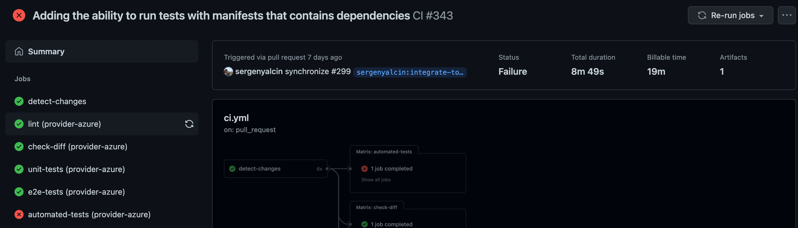
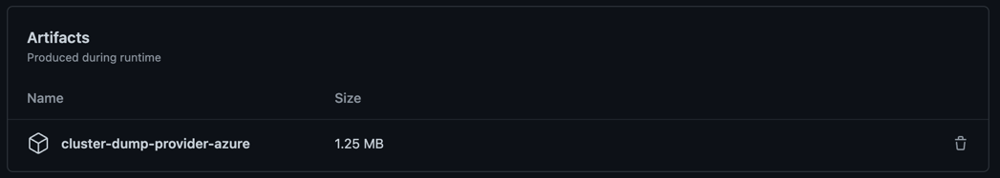
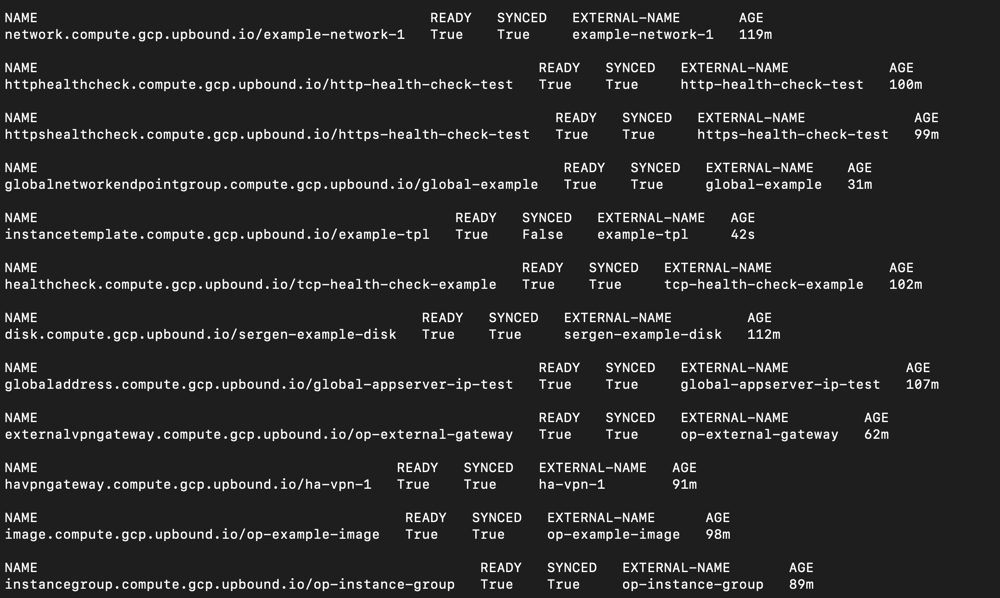

<!--
SPDX-FileCopyrightText: 2023 The Crossplane Authors <https://crossplane.io>

SPDX-License-Identifier: CC-BY-4.0
-->
# Testing resources by using Uptest

`Uptest` provides a framework to test resources in an end-to-end pipeline during
the resource configuration process. Together with the example manifest
generation tool, it allows us to avoid manual interventions and shortens testing
processes.

These integration tests are costly as they create real resources in cloud
providers. So they are not executed by default. Instead, a comment should be
posted to the PR for triggering tests.

Tests can be run by adding something like the following expressions to the
anywhere in comment:

- `/test-examples="provider-azure/examples/kubernetes/cluster.yaml"`
- `/test-examples="provider-aws/examples/s3/bucket.yaml, provider-aws/examples/eks/cluster.yaml"`

You can trigger a test job for an only provider. Provider that the tests will
run is determined by using the first element of the comma separated list. If the
comment contains resources that are from different providers, then these
different resources will be skipped. So, if you want to run tests more than one
provider, you must post separate comments for each provider.

## Debugging Failed Test

After a test failed, it is important to understand what is going wrong. For
debugging the tests, we push some collected logs to GitHub Action artifacts.
These artifacts contain the following data:

- Dump of Kind Cluster
- Kuttl input files (Applied manifests, assertion files)
- Managed resource yaml outputs

To download the artifacts, firstly you must go to the `Summary` page of the
relevant job:



Then click the `1` under the `Artifacts` button in the upper right. If the
automated tests run for more than one providers, this number will be higher.

When you click this, you can see the `Artifacts` list of job. You can download
the artifact you are interested in by clicking it.



When a test fails, the first point to look is the provider container's logs. In
test environment, we run provider by using the `-d` flag to see the debug logs.
In the provider logs, it is possible to see all errors caused by the content of
the resource manifest, caused by the configuration or returned by the cloud
provider.

Also, as you know, yaml output of the managed resources (it is located in the
`managed.yaml` of the artifact archive's root level) are very useful to catch
errors.

If you have any doubts about the generated kuttl files, please check the
`kuttl-inputs.yaml` file in the archive's root.

## Running Uptest locally

For a faster feedback loop, you might want to run `uptest` locally in your
development setup.

To do so run a special `uptest-local` target that accepts `PROVIDER_NAME` and
`EXAMPLE_LIST` arguments as in the example below.

```bash
make uptest-local PROVIDER_NAME=provider-azure EXAMPLE_LIST="provider-azure/examples/resource/resourcegroup.yaml"
```

You may also provide all the files in a folder like below:

```bash
make uptest-local PROVIDER_NAME=provider-aws EXAMPLE_LIST=$(find provider-aws/examples/secretsmanager/*.yaml | tr '\n' ',')
```

The local invocation is intentionally lightweight and skips the local cluster,
credentials and ProviderConfig setup assuming you already have it all already
configured in your environment.

For a more heavyweight setup see `run_automated_tests` target which is used in a
centralized GitHub Actions invocation.

## Testing Instructions and Known Error Cases

While configuring resources, the testing effort is the longest part. Because the
characteristics of cloud providers and services can change. This test effort can
be executed in two main methods. The first one is testing the resources in a
manual way and the second one is using the `Uptest` that is an automated test
tool for Official Providers. `Uptest` provides a framework to test resources in
an end-to-end pipeline during the resource configuration process. Together with
the example manifest generation tool, it allows us to avoid manual interventions
and shortens testing processes.

### Testing Methods

#### Manual Test

Configured resources can be tested by using manual method. This method generally
contains the environment preparation and creating the example manifest in the
Kubernetes cluster steps. The following steps can be followed for preparing the
environment:

1. Obtaining a Kubernetes Cluster: For manual/local effort, generally a Kind
cluster is sufficient and can be used. For detailed information about Kind see
[this repo].
An alternative way to obtain a cluster is: [k3d]

2. Registering the CRDs (Custom Resource Definitions) to Cluster: We need to
apply the CRD manifests to the cluster. The relevant manifests are located in
the `package/crds` folder of provider subdirectories such as:
`provider-aws/package/crds`. For registering them please run the following
command: `kubectl apply -f package/crds`

3. Create ProviderConfig: ProviderConfig Custom Resource contains some
configurations and credentials for the provider. For example, to connect to the
cloud provider, we use the credentials field of ProviderConfig. For creating the
ProviderConfig with correct credentials, please see [the documentation]:

4. Start Provider: For every Custom Resource, there is a controller and these
controllers are part of the provider. So, for starting the reconciliations for
Custom Resources, we need to run the provider (collect of controllers). For
running provider, two ways can be used:
    - `make run`: This make target starts the controllers.
    - Running provider in IDE: Especially for debug effort, you may want to use
    an IDE. For running the provider in an IDE, some program arguments are
    needed to be passed. The following example is for `provider-aws`.
    Values of the `--terraform-version`, `--terraform-provider-source` and
    `--terraform-provider-version` options can be collected from the Makefile of
    the provider: `provider-aws/Makefile`
      - `-d` -> To see debug level logs. `make run` also is run the provider in
      debug mode.
      - `--terraform-version 1.2.1`: Terraform version.
      - `--terraform-provider-source hashicorp/aws`: Provider source name.
      - `--terraform-provider-version 4.15.1`: Provider version.

Now our preparation steps are completed. This is the time for testing:

- Create Examples and Start Testing: After completing the steps above, your
environment is ready to testing. For testing, we need to apply some example
manifests to the cluster. The manifests in the `examples-generated` folder can be
used as a first step. Before starting to change these manifests, you should move
them from `examples-generated` folder to the `examples` folder. There are two
main reasons for this. The first one is that these manifests are generated for
every `make generate` command to catch the latest changes in the resources. So
for preserving your changes moving them is necessary. The second reason is that
we use the `examples` folder as the source for keeping these manifests and using
them in our automated test effort.

In some cases, these manifests need manual interventions so, for successfully
applying them to a cluster (passing the Kubernetes schema validation) you may
need to do some work. Possible problems you might face:

- The generated manifest cannot provide at least one required field. So
   before creating the resource you must set the required field in the manifest.
- In some fields of generated manifest the types of values cannot be matched.
   For example, X field expects a string but the manifest provides an integer.
   In these cases you need to provide the correct type in your example YAML
   manifest.

Successfully applying these example manifests to cluster is only the
first step. After successfully creating these Managed Resources, we need to
check whether their statuses are ready or not. So we need to expect a `True`
value for `Synced` and `Ready` conditions. To check the statuses of all created
example manifests quickly you can run the `kubectl get managed` command. We will
wait for all values to be `True` in this list:



When all of the `Synced` and `Ready` fields are `True`, the test was
successfully completed! However, if there are some resource values that are
`False`, you need to debug this situation. The main debugging ways will be
mentioned in the next parts.

> [!NOTE]
> For following the test processes in a more accurate way, we have `UpToDate`
  status condition. This status condition will be visible when you set the
  annotation: `upjet.upbound.io/test=true`. Without adding this annotation you
  cannot see the mentioned condition. Uptest adds this annotation to the tested
  resources, but if you want to see the value of conditions in your tests in
  your local environment (during manual tests) you need to add this condition
  manually. For the goal and details of this status condition please see this
  PR: https://github.com/upbound/crossplane/pull/23

> [!NOTE]
> The resources that are tried to be created may have dependencies. For example,
  you might actually need resources Y and Z while trying to test resource X.
  Many of the generated examples include these dependencies. However, in some
  cases, there may be missing dependencies. In these cases, please add the
  relevant dependencies to your example manifest. This is important both for you
  to pass the tests and to provide the correct manifests.

#### Automated Tests - Uptest

Configured resources can be tested also by using `Uptest`. We can also separate
this part into two main application methods:

##### Using Uptest in GitHub Actions

We have a GitHub workflow `Automated Tests`. This is an integration test for
Official Providers. This workflow prepares the environment (provisioning Kind
cluster, creating ProviderConfig, installing Provider, etc.) and runs the Uptest
with the input manifest list that will be given by the person who triggers the
test.

This `Automated Tests` job can be triggered from the PR that contains the
configuration test works for the related resources/groups. For triggering the
test, you need to leave a comment in the PR in the following format:

`/test-examples="provider-aws/examples/s3/bucket.yaml, provider-aws/examples/eks/cluster.yaml"`

We test using the API group approach for `Automated-Tests`. So, we wait for the
entire API group's resources to pass the test in a single test run. This means
that while triggering tests, leaving the following type of comment is expected:

`/test-examples="provider-aws/examples/s3`

This comment will test all the examples of the `s3` group.

**Ignoring Some Resources in Automated Tests**

Some resources require manual intervention such as providing valid public keys
or using on-the-fly values. These cases can be handled in manual tests, but in
cases where we cannot provide generic values for automated tests, we can skip
some resources in the tests of the relevant group via an annotation:

```yaml
upjet.upbound.io/manual-intervention: "The Certificate needs to be provisioned successfully which requires a real domain."
```

The key is important for skipping, we are checking this `upjet.upbound.io/manual-intervention`
annotation key and if is in there, we skip the related resource. The value is also
important to see why we skip this resource.

> [!NOTE]
> For resources that are ignored during Automated Tests, manual testing is a
  must. Because we need to make sure that all resources published in the
  `v1beta1` version are working.

At the end of the tests, Uptest will provide a report for you. And also for all
GitHub Actions, we will have an artifact that contains logs for debugging. For
details please see [here].

##### Using Uptest in Local Dev Environment

The main difference between running `Uptest` from your local environment and
running GitHub Actions is that the environment is also prepared during GitHub
Actions. During your tests on local, `Uptest` is only responsible for creating
instance manifests and assertions of them. Therefore, all the preparation steps
mentioned in the Manual Testing section are also necessary for tests performed
using `Uptest` locally.

After preparing the testing environment, you should run the following command to
trigger tests locally by using `Uptest`:

Example for single file test:

```bash
make uptest-local PROVIDER_NAME=provider-aws EXAMPLE_LIST=provider-aws/examples/secretsmanager/secret.yaml
```

Example of whole API Group test:

```bash
make uptest-local PROVIDER_NAME=provider-aws EXAMPLE_LIST=$(find provider-aws/examples/secretsmanager/*.yaml | tr '\n' ',')
```

### Debugging Tests

Whether the tests fail using `Uptest` or when testing manually, the steps to be
followed are the same. What finally failed was a Managed Resource tested against
Official Providers. In this case, the first thing to do is to check the manifest
of the failing resource (where the value of `Synced` or `Ready` condition is
`False`) in the cluster.

If the test was in your local environment, you can check the current state of
the resource by using the following command:
`kubectl get network.compute.gcp.upbound.io/example-network-1 -o yaml`

If the test ran in the GitHub Actions, you need to check the action artifact
mentioned in the previous part of the documentation.

The second important point to understand the problem is the provider logs. If
the test was in your local environment, you need to check the `make run` or IDE
logs. If testing was in GitHub Actions, you need to check the action artifact.
It contains the cluster dump that has the provider logs.

## Known Error Cases

1. `prevent_destroy` Case: In some cases, when unexpected changes or situations
occur in the resources, Terraform tries to delete the related resource and
create it again. However, in order to prevent this situation, the resources are
configurable. In this context, the name of the field where you can provide this
control is `prevent_destroy`. Please see details of [Terraform Resource Lifecycle].
For resources in Official Providers, this value defaults to `true`. So the
deletion of the resource is blocked.

Encountering this situation (i.e. Terraform trying to delete and recreate the
resource) is not normal and may indicate a specific error. Some possible
problems could be:

- As a result of overriding the constructed ID after Terraform calls, Terraform
  could not match the IDs and tries to recreate the resource. Please see
  [this issue] for details. In this type of cases, you need to review your
  external name configuration.
- Crossplane's concept of [Late Initialization] may cause some side effects.
  One of them is while late initialization, filling a field that is not initially
  filled on the manifest may cause the resource to be destroyed and recreated.
  In such a case, it should be evaluated that which field's value is set will
  cause such an error. During this evaluation, it will be necessary to make use
  of the terraform registry document. In the end, the field that is thought to
  solve the problem is put into the ignore list using the
  [late initialization configuration] and the test is repeated from the
  beginning.
- Some resources fall into `tainted` state as a result of certain steps in the
  creation process fail. Please see [tainted issue] for details.

2. External Name Configuration Related Errors: The most common known issue is
errors in the external name configuration. A clear error message regarding this
situation may not be visible. Many error messages can be related to an incorrect
external name configuration. Such as, a field cannot be read properly from the
parameter map, there are unexpected fields in the generated `main.tf.json` file,
etc.

Therefore, when debugging a non-ready resource; if you do not see errors
returned by the Cloud API related to the constraints or characteristics of the
service (for example, you are stuck on the creation limit of this resource in
this region, or the use of the relevant field for this resource depends on the
following conditions etc.), the first point to check is external name
configuration.

3. Late Initialization Errors: Late Initialization is one of the key concepts of
Crossplane. It allows for some values that are not initially located in the
resource's manifest to be filled with the values returned by the cloud providers.

As a side effect of this, some fields conflict each other. In this case, a
detailed error message is usually displayed about which fields conflict with
each other. In this case, the relevant field should be skipped by [these steps].

4. Provider Service Specific Errors: Every cloud provider and every service has
its own features and behavior. Therefore, you may see special error messages in
the status of the resources from time to time. These may say that you are out of
the allowed values in some fields of the resource, or that you need to enable
the relevant service, etc. In such cases, please review your example manifest
and try to find the appropriate example.

> [!IMPORTANT]
> `make reviewable` and `kubectl apply -f package/crds` commands must be run
  after any change that will affect the schema or controller of the
  configured/tested resource. In addition, the provider needs to be restarted
  after the changes in the controllers, because the controller change actually
  corresponds to the changes made in the running code.

[this repo]: https://github.com/kubernetes-sigs/kind
[the documentation]: https://crossplane.io/docs/v1.9/getting-started/install-configure.html#install-configuration-package
[here]: https://github.com/upbound/official-providers/blob/main/docs/testing-resources-by-using-uptest.md#debugging-failed-test
[these steps]: https://github.com/upbound/crossplane/blob/main/docs/configuring-a-resource.md#late-initialization-configuration
[late initialization configuration]: https://github.com/upbound/crossplane/blob/main/docs/configuring-a-resource.md#late-initialization-configuration
[Terraform Resource Lifecycle]: https://learn.hashicorp.com/tutorials/terraform/resource-lifecycle
[this issue]: https://github.com/upbound/crossplane/issues/32
[Late Initialization]: https://crossplane.io/docs/v1.9/concepts/managed-resources.html#late-initialization
[tainted issue]: https://github.com/upbound/crossplane/issues/80
[k3d]: https://k3d.io/
